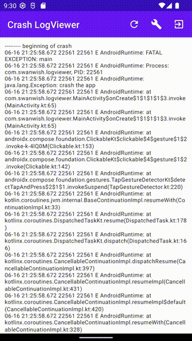

# Get crash log from application

This is a demo application to get the crash log inside application, 
there are three buttons, one for refresh the crash log, 
one for clean the crash log and the other one is crash log, 
so on the next startup, the app can get the crash log.

## Main code to get crash log

```kotlin
try {
    val process = Runtime.getRuntime().exec("logcat -b crash -d")
    val reader = BufferedReader(InputStreamReader(process.inputStream))
    var read: Int
    val buffer = CharArray(4096)
    val output = StringBuffer()
    do {
        read = reader.read(buffer)
        if (read < 0) {
            break
        }
        output.append(buffer, 0, read)
    } while (read > 0)
    reader.close()

    process.waitFor()
    withContext(Dispatchers.Main) {
        _crashLog.value = output.toString()
    }
} catch (e: IOException) {
    e.printStackTrace()
    withContext(Dispatchers.Main) {
        _crashLog.value = "Load crashlog failed, the error message is ${e.message}"
    }
}
```

## Screenshot


